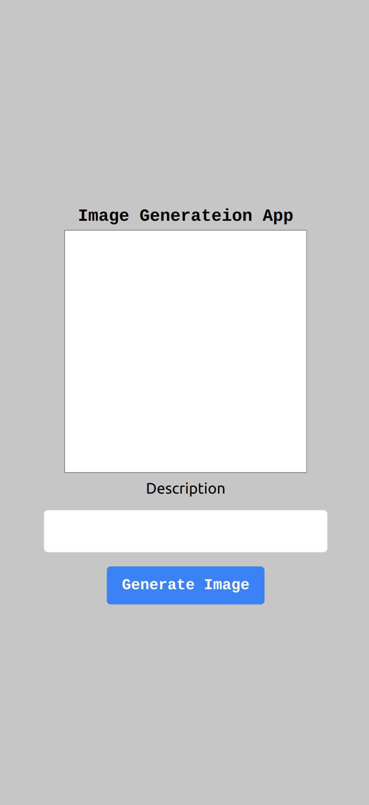
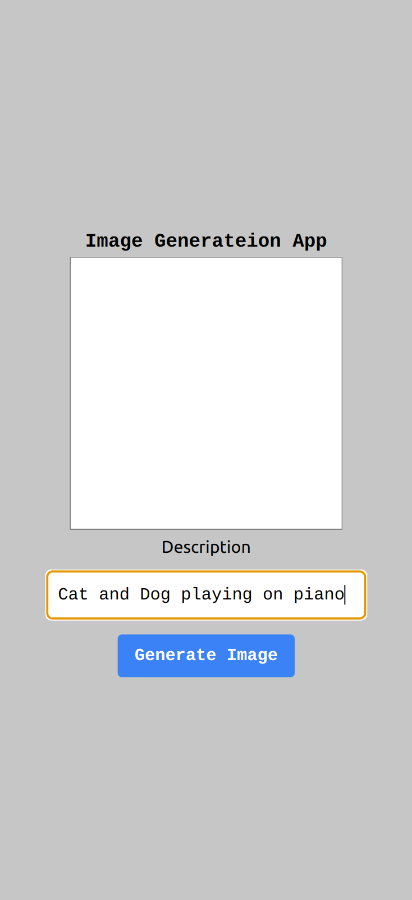
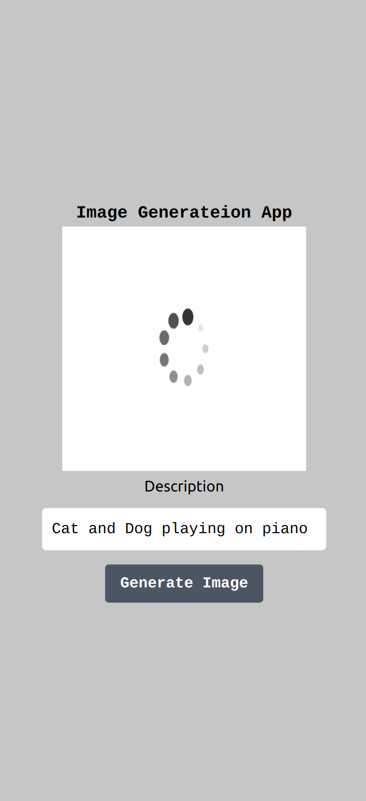
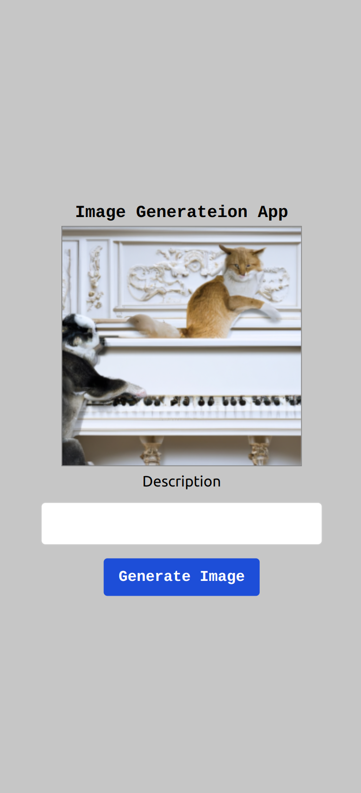

# Image Generataion App

### Home page

- Type your query in Description input field and press Generate Image button

* Client will send request to the server, Server will procceced the request and send it to Image Generation AI service.
* Loader will apear on the screen while image is generated.
* Image will apear shorly on the screen.

### To build the app:

- You can create account on the https://platform.openai.com/ and generate enviroment variables.
- crate `.env` file in `client` and `server` folders
- in `server` folder `.env` should contain `OPEN_AI_KEY=yourOpenAiKey`

- For now you don't need to use MongoDB enviroment variables.
- Mongodb part of the backend code was created for the future development of the app to store user data, logs, history and ext.
